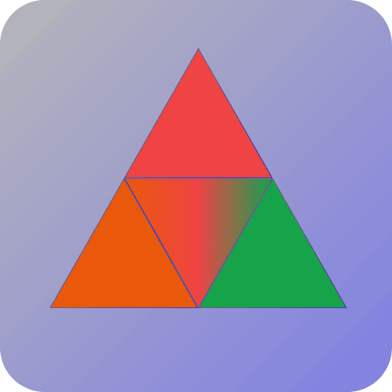

<div align="center">


<br/>

<a href="https://meel.my.id">
  
</a>
<a href="https://www.youtube.com/@mifada2543">
  
</a>
<a href="https://github.com/mifada2543">
  
</a>

<br/>


</div>

---

## 👋 Tentang Aku

> _"Masih belajar, tapi berani nyoba bangun sesuatu dari nol."_

Aku **pelajar dan pemula** yang lagi seru-serunya belajar membangun aplikasi web dan proyek berbasis AI. Mulai dari media hub pribadi, asisten AI sederhana, sampai gateway WebView — semuanya aku pelajari sambil jalan lewat proyek nyata.

```yaml
Nama: Mifada
Peran: Pelajar & Pemula di Dunia Coding
Fokus: PHP · Laravel-style Projects · Python · AI Integration
Sedang: Belajar membangun & merapikan proyek-proyek open source
Ikuti Aku: YouTube @mifada2543
```

---

## 🛠️ Tech Stack & Tools

<div align="center">

### ⚙️ Backend


### 🎨 Frontend


### 🧰 Tools


</div>

---

## 🚀 Proyek Unggulan

<table>
  <tr>
    <td width="50%">
      <h3> MEeL-HUB</h3>
      <p>Media hub pribadi all-in-one berbasis PHP & MySQL — streaming video (HLS), musik lossless, buku digital, dan cloud drive. Dilengkapi transcoding FFmpeg, integrasi yt-dlp, serta mini-game arcade.</p>
      <p>
        
        
        
      </p>
      <a href="https://github.com/mifada2543/MEeL-HUB"></a>
    </td>
    <td width="50%">
      <h3>🤖 FikaAI</h3>
      <p>Asisten AI sederhana berbasis Python dengan tampilan GUI dan penyimpanan data menggunakan SQLite.</p>
      <p>
        
        
        
      </p>
      <a href="https://github.com/mifada2543/FikaAI"></a>
    </td>
  </tr>
  <tr>
    <td width="50%">
      <h3>🧠 RoKenAI</h3>
      <p>Proyek berbasis AI yang dibangun menggunakan PHP, dilengkapi dokumentasi lewat GitHub Pages.</p>
      <p>
        
        
      </p>
      <a href="https://github.com/mifada2543/RoKenAI"></a>
    </td>
    <td width="50%">
      <h3>🌐 WVGM</h3>
      <p>WebView Gateway sederhana untuk kebutuhan aplikasi Android, ringan dan mudah dipakai.</p>
      <p>
        
        
      </p>
      <a href="https://github.com/mifada2543/WVGM"></a>
    </td>
  </tr>
  <tr>
    <td width="50%">
      <h3>🎭 mikkan</h3>
      <p>Proyek Live2D (L2D) yang dikerjakan bersama tim beranggotakan 3 orang.</p>
      <p>
        
        
      </p>
      <a href="https://github.com/mifada2543/mikkan"></a>
    </td>
    <td width="50%">
      <h3>🗂️ MEPeL</h3>
      <p>Proyek berbasis PHP dengan skala pengembangan yang cukup besar.</p>
      <p>
        
      </p>
      <a href="https://github.com/mifada2543/MEPeL"></a>
    </td>
  </tr>
  <tr>
    <td width="50%">
      <h3>🧪 Web</h3>
      <p>Kumpulan eksperimen dan proyek pengembangan web, dipublikasikan lewat GitHub Pages.</p>
      <p>
        
      </p>
      <a href="https://github.com/mifada2543/Web"></a>
    </td>
    <td width="50%">
    </td>
  </tr>
</table>

> 💡 Lihat semua repository lainnya di tab [Repositories](https://github.com/mifada2543?tab=repositories).

---

## 🏅 Achievements

<div align="center">


</div>

---

## 📊 GitHub Stats

<div align="center">


<br/>


</div>

---

## 🤝 Yuk Terhubung

<div align="center">

Terbuka untuk **kolaborasi**, ngobrol seputar coding, atau sekadar say hi 👋

<a href="https://meel.my.id">
  
</a>
<a href="https://www.youtube.com/@mifada2543">
  
</a>

<br/><br/>


</div>
